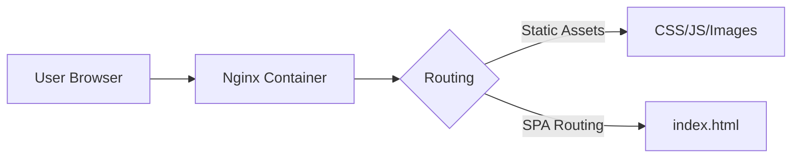

# ⌚ Ben 10: Alien Interface

## 🚀 Project Overview

**Ben 10: Alien Interface** is a modern Single Page Application (SPA) designed to showcase a high-performance DevOps workflow. While the frontend serves as an **interactive character database** inspired by the Ben 10 universe, the core of this project lies in its **infrastructure and deployment strategy**.

This project demonstrates professional-grade **containerization** using multi-stage builds and **web server orchestration** with Nginx, ensuring the application is lightweight, secure, and ready for production.

---

## ✨ Key Features

### 💻 Frontend Excellence

* **Performance-First:** Built with **Vite** for near-instant Hot Module Replacement (HMR) and optimized build times.
* **Modern Architecture:** Developed using **React 18** with functional components and custom hooks.
* **Fully Responsive:** A "Cyberpunk" inspired UI that adapts seamlessly across mobile, tablet, and desktop devices.

### ⚙️ DevOps & Infrastructure

* **Optimized Multi-Stage Builds:** Utilizes a dual-stage Dockerfile that reduces the final production image size by over **90%**.
* **Production-Grade Web Server:** Implements **Nginx (Alpine)** to handle SPA routing, static asset caching, and reverse proxying.
* **Infrastructure as Code (IaC):** Defined via `docker-compose.yml` for "one-command" deployments across any environment.
* **Security Focused:** Uses minimal Alpine-based images to reduce the attack surface.

---

## 🛠️ Tech Stack

| Category | Technology |
| --- | --- |
| **Frontend** | React 18, Vite, CSS3 (Aesthetic UI) |
| **Containerization** | Docker, Docker Compose |
| **Web Server** | Nginx (Mainline Alpine) |
| **Environment** | Linux / Unix |

---

## 🏗️ Architecture & Build Strategy

### 1. Multi-Stage Docker Workflow

To maintain a professional deployment, I implemented a two-stage build process:

1. **Stage 1 (The Builder):** Uses `node:alpine` to install dependencies and run `npm run build`. This stage contains all the "bloat" required for building (compilers, npm cache) but is discarded after the build.
2. **Stage 2 (The Runner):** Uses `nginx:alpine`. Only the minified `/dist` folder from Stage 1 is copied here. The result is a production image that is typically **under 25MB**.

### 2. High-Level Flow



---

## 🐳 Getting Started

### Prerequisites

* [Docker Desktop](https://www.docker.com/products/docker-desktop/) installed and running.

### Quick Start (Production Mode)

1. **Clone the Repository**
```bash
git clone https://github.com/IshuAgrawal11/ben10.git
cd ben10

```


2. **Launch via Docker Compose**
```bash
docker compose up -d

```


3. **Access the App**
Visit [http://localhost:8000](https://www.google.com/search?q=http://localhost:8000)

---

## 📂 Project Structure

```plaintext
ben10/
├── public/            # Static assets (favicons, etc.)
├── src/               # React source code (Components, Hooks, Assets)
├── Dockerfile         # Optimized multi-stage build config
├── docker-compose.yml # Orchestration for local/dev environments
├── nginx.conf         # Custom Nginx config for SPA routing (try_files)
├── package.json       # Project dependencies & scripts
└── README.md          # Documentation

```

---

## 🧠 Why This Project?

This repository serves as a blueprint for **Frontend DevOps**. Instead of just hosting a site on a managed service, this project explores the underlying mechanics of:

* **Environment Parity:** Ensuring the app runs the same on my machine, your machine, and the server.
* **Efficiency:** How to leverage Nginx's `try_files` to prevent 404 errors on React Router refreshes.
* **Scaling:** Demonstrating how easily this container could be deployed into a Kubernetes cluster or an AWS ECS instance.

---

## 🤝 Contributing

1. Fork the Project.
2. Create your Feature Branch (`git checkout -b feature/AmazingFeature`).
3. Commit your Changes (`git commit -m 'Add some AmazingFeature'`).
4. Push to the Branch (`git push origin feature/AmazingFeature`).
5. Open a Pull Request.

---

## 📜 License

Distributed under the **MIT License**. See `LICENSE` for more information.

**Created by [Ishu Agrawal**](https://www.google.com/search?q=https://github.com/IshuAgrawal11)

---
