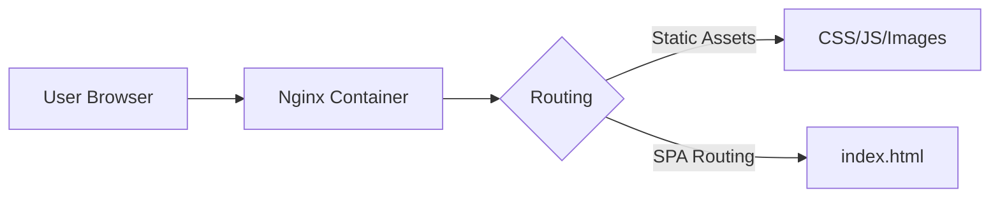

# ⌚ Ben 10 - Alien Interface


## 🚀 Project Overview

**Ben 10** is a modern Single Page Application (SPA) built with **React** and **Vite**, designed to demonstrate a complete DevOps workflow. The application serves as a [write a short description: e.g., interactive character dashboard / alien database / mini-game] inspired by the Ben 10 universe.

Beyond the frontend, this project focuses on **containerization and production-grade deployment**. It features a multi-stage Docker build that optimizes the final image size and uses Nginx as a high-performance reverse proxy.

## ✨ Features

### 💻 Frontend
* **Lightning Fast:** Built with Vite for instant server start and HMR.
* **Responsive Design:** optimized for mobile and desktop views.
* **Modern UI:** Developed using React functional components and hooks.

### ⚙️ DevOps & Infrastructure
* **Dockerized:** Fully containerized application for consistent environments.
* **Multi-Stage Build:** optimized Dockerfile reduces image size by ~90% (uses `node:alpine` for building and `nginx:alpine` for serving).
* **Production Ready:** Nginx configured to handle SPA routing and serve static assets efficiently.
* **Orchestration:** Includes `docker-compose.yml` for easy local deployment.

## 🛠️ Tech Stack

* **Frontend Framework:** React 18
* **Build Tool:** Vite
* **Containerization:** Docker
* **Web Server:** Nginx (Alpine Linux)
* **Version Control:** Git & GitHub

## 🐳 Getting Started (Docker)

The easiest way to run this application is using Docker. You do not need Node.js installed on your machine.

### Prerequisites
* Docker
* Docker Compose

## 1. Clone the Repository
```bash
git clone [https://github.com/IshuAgrawal11/ben10.git]
cd ben10
```

## 2. Run with Docker Compose

This will pull the latest image from Docker Hub and start the service.

```bash
docker compose up -d
```

Open your browser and visit:
👉 [http://localhost:8000](http://localhost:8000)

---

## 3. Stop the Application

```bash
docker compose down
```

---

## 🔧 Local Development (Manual)

If you want to edit the code, you can run it locally without Docker.

### Install Dependencies

```bash
npm install
```

### Start Dev Server

```bash
npm run dev
```

### Build for Production

```bash
npm run build
```

---

## 📂 Project Structure

```plaintext
ben10/
├── public/            # Static assets
├── src/               # React source code
├── Dockerfile         # Multi-stage Docker configuration
├── docker-compose.yml # Container orchestration config
├── nginx.conf         # Nginx configuration for SPA routing
├── package.json       # Dependencies and scripts
└── README.md          # Project documentation
```

---

## 🤝 Contributing

Contributions, issues, and feature requests are welcome!

1. Fork the Project
2. Create your Feature Branch

   ```bash
   git checkout -b feature/AmazingFeature
   ```
3. Commit your Changes

   ```bash
   git commit -m "Add some AmazingFeature"
   ```
4. Push to the Branch

   ```bash
   git push origin feature/AmazingFeature
   ```
5. Open a Pull Request


---

## 🏗️ Architecture & Build Strategy

### 1. Multi-Stage Docker Workflow

To maintain a professional deployment, I implemented a two-stage build process:

1. **Stage 1 (The Builder):** Uses `node:alpine` to install dependencies and run `npm run build`. This stage contains all the "bloat" required for building (compilers, npm cache) but is discarded after the build.
2. **Stage 2 (The Runner):** Uses `nginx:alpine`. Only the minified `/dist` folder from Stage 1 is copied here. The result is a production image that is typically **under 25MB**.

### 2. High-Level Flow



---


## 🧠 Why This Project?

This repository serves as a blueprint for **Frontend DevOps**. Instead of just hosting a site on a managed service, this project explores the underlying mechanics of:

* **Environment Parity:** Ensuring the app runs the same on my machine, your machine, and the server.
* **Efficiency:** How to leverage Nginx's `try_files` to prevent 404 errors on React Router refreshes.
* **Scaling:** Demonstrating how easily this container could be deployed into a Kubernetes cluster or an AWS ECS instance.

---


## 📜 License

Distributed under the **MIT License**. See `LICENSE` for more information.

**Created by [Ishu Agrawal**](https://www.google.com/search?q=https://github.com/IshuAgrawal11)

---
